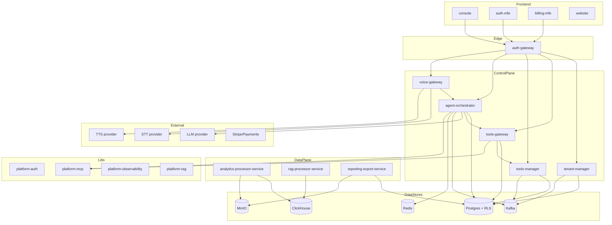
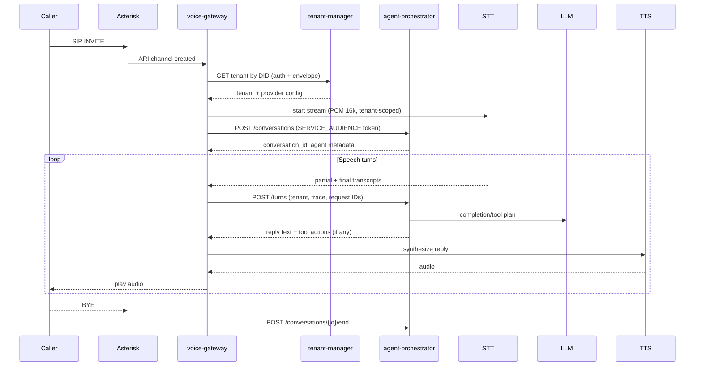
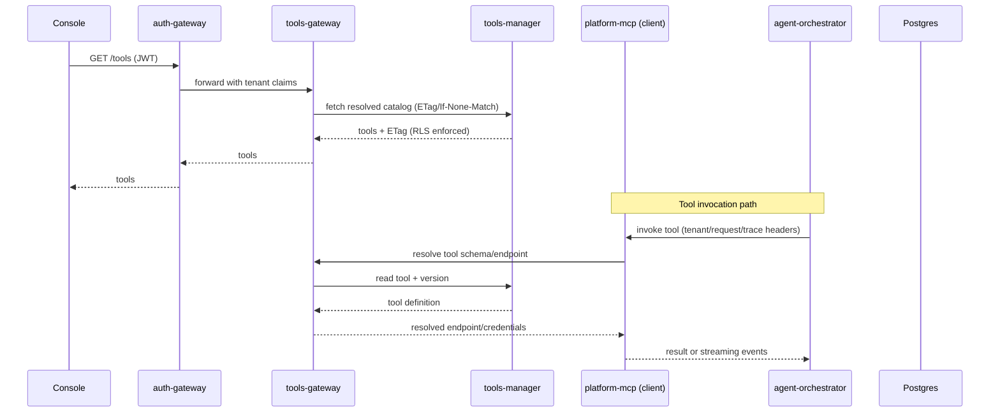
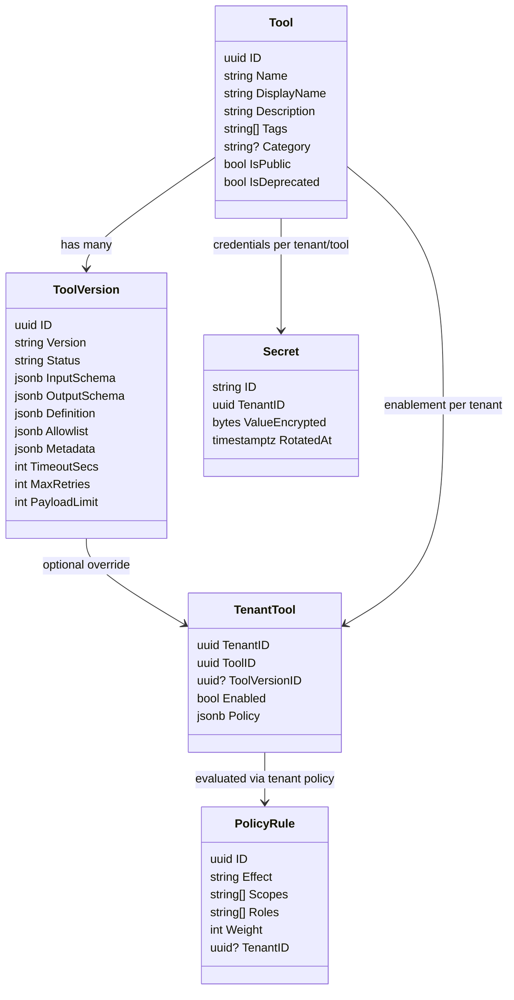

# Architecture Diagrams (en-US)

## System Overview

## Sequence — Voice Call (STT → Agent → TTS)

## Sequence — Tool Resolution via Tools Gateway / platform-mcp

## Class Diagram — Tools Catalog (simplified)

