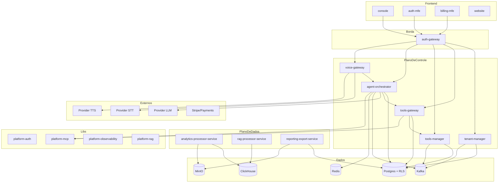
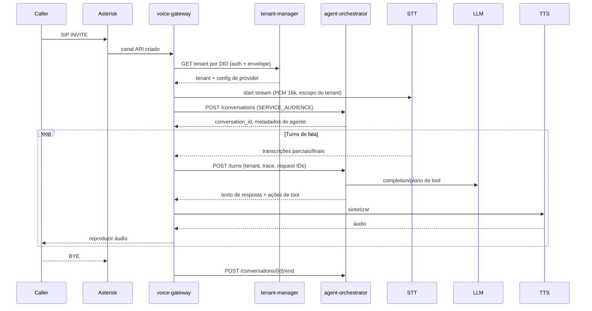
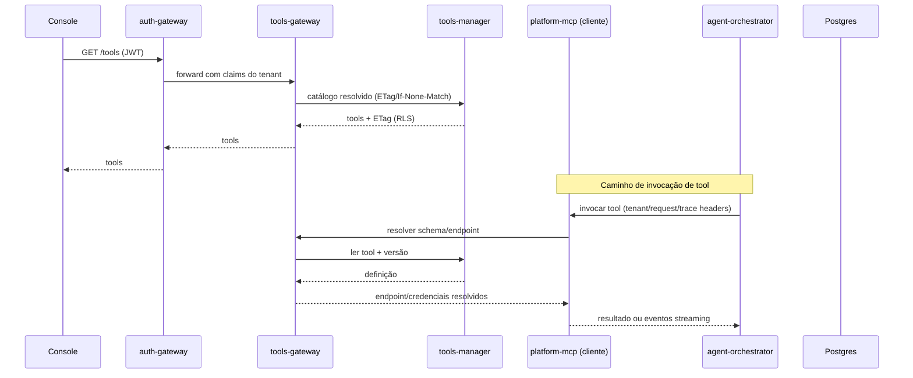
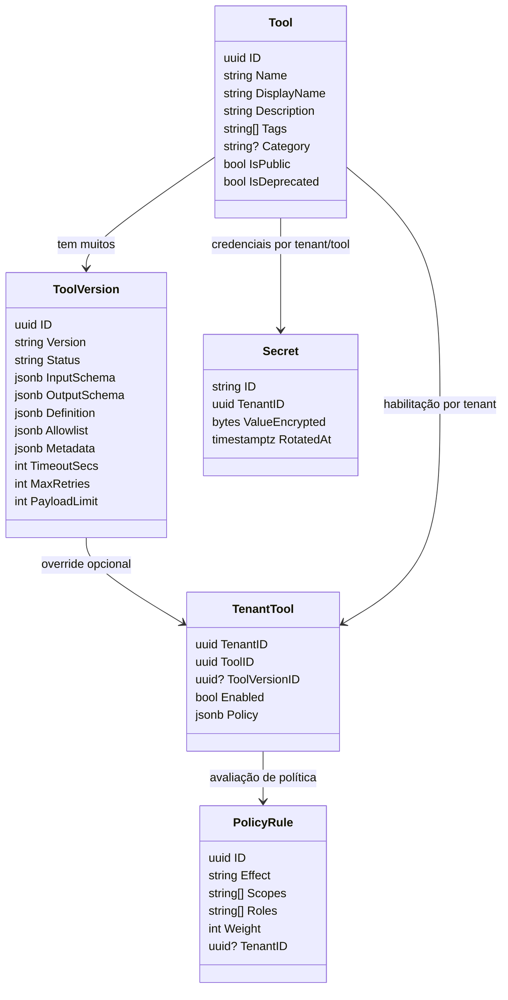

# Diagramas de Arquitetura (pt-BR)

## Visão Geral do Sistema

## Sequência — Chamada de Voz (STT → Agente → TTS)

## Sequência — Resolução de Ferramenta via Tools Gateway / platform-mcp

## Diagrama de Classes — Catálogo de Ferramentas (simplificado)

