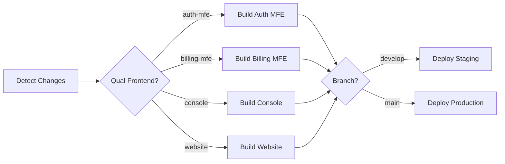

# Frontend Deployment Guide

Este guia documenta o processo de deployment dos frontends da plataforma Serphona usando Docker e Kubernetes com CI/CD automatizado.

## 📋 Índice

- [Visão Geral](#visão-geral)
- [Arquitetura](#arquitetura)
- [Desenvolvimento Local](#desenvolvimento-local)
- [Docker](#docker)
- [Kubernetes](#kubernetes)
- [CI/CD Pipeline](#cicd-pipeline)
- [Configuração de Secrets](#configuração-de-secrets)
- [Troubleshooting](#troubleshooting)

## 🔍 Visão Geral

O projeto possui 4 aplicações frontend:

1. **auth-mfe** - Microfrontend de autenticação (porta 3002)
2. **billing-mfe** - Microfrontend de billing (porta 3003)
3. **console** - Console administrativo principal (porta 3000)
4. **website** - Website público (porta 3001)

Todas as aplicações são construídas com React + Vite e servidas via Nginx em produção.

## 🏗️ Arquitetura

### Stack Tecnológico

- **Build**: Node 20 Alpine
- **Runtime**: Nginx Alpine
- **Orquestração**: Kubernetes
- **CI/CD**: GitHub Actions
- **Registry**: GitHub Container Registry (ghcr.io)
- **Package Manager**: Helm 3

### Estrutura de Arquivos

```
frontend/
├── auth-mfe/
│   ├── Dockerfile
│   ├── nginx.conf
│   └── .dockerignore
├── billing-mfe/
│   ├── Dockerfile
│   ├── nginx.conf
│   └── .dockerignore
├── console/
│   ├── Dockerfile
│   ├── nginx.conf
│   └── .dockerignore
└── website/
    ├── Dockerfile
    ├── nginx.conf
    └── .dockerignore

infra/
└── helm/
    └── auth-mfe/
        ├── Chart.yaml
        ├── values.yaml
        └── templates/
            ├── deployment.yaml
            ├── service.yaml
            ├── ingress.yaml
            ├── serviceaccount.yaml
            └── hpa.yaml
```

## 💻 Desenvolvimento Local

### Usando npm (Recomendado para desenvolvimento)

```bash
# Auth MFE
cd frontend/auth-mfe
npm install
npm run dev  # Porta 3002

# Billing MFE
cd frontend/billing-mfe
npm install
npm run dev  # Porta 3003

# Console
cd frontend/console
npm install
npm run dev  # Porta 3000

# Website
cd frontend/website
npm install
npm run dev  # Porta 3001
```

### Usando Docker Compose

Para testar a build de produção localmente:

```bash
# Construir e iniciar todos os frontends
docker-compose -f docker-compose.frontend.yml up --build

# Iniciar apenas um frontend específico
docker-compose -f docker-compose.frontend.yml up auth-mfe

# Parar todos os serviços
docker-compose -f docker-compose.frontend.yml down
```

**URLs de Acesso:**
- Console: http://localhost:3000
- Website: http://localhost:3001
- Auth MFE: http://localhost:3002
- Billing MFE: http://localhost:3003

## 🐳 Docker

### Build Manual

Para construir uma imagem Docker manualmente:

```bash
# Auth MFE
cd frontend/auth-mfe
docker build -t serphona/auth-mfe:latest .

# Billing MFE
cd frontend/billing-mfe
docker build -t serphona/billing-mfe:latest .

# Console
cd frontend/console
docker build -t serphona/console:latest .

# Website
cd frontend/website
docker build -t serphona/website:latest .
```

### Multi-stage Build

Todos os Dockerfiles utilizam multi-stage build para otimização:

1. **Stage 1 (Builder)**: Instala dependências e constrói a aplicação
2. **Stage 2 (Runtime)**: Copia apenas os arquivos necessários para Nginx

### Características

- ✅ Imagens otimizadas (~20MB)
- ✅ Security context não-root (usuário 101)
- ✅ Health checks integrados
- ✅ Gzip compression
- ✅ Cache de assets estáticos
- ✅ Security headers

## ☸️ Kubernetes

### Estrutura dos Helm Charts

Cada frontend possui seu próprio Helm chart com os seguintes recursos:

- **Deployment**: Gerencia os pods da aplicação
- **Service**: Expõe a aplicação internamente
- **Ingress**: Configura o acesso externo via HTTPS
- **ServiceAccount**: Identidade do pod no cluster
- **HorizontalPodAutoscaler**: Escala automaticamente baseado em CPU/memória

### Deploy Manual com Helm

#### Pré-requisitos

```bash
# Instalar Helm
curl https://raw.githubusercontent.com/helm/helm/main/scripts/get-helm-3 | bash

# Configurar kubectl
export KUBECONFIG=/path/to/kubeconfig
```

#### Deploy

```bash
# Auth MFE
helm upgrade --install auth-mfe ./infra/helm/auth-mfe \
  --namespace production \
  --create-namespace \
  --set image.repository=ghcr.io/your-org/serphona/auth-mfe \
  --set image.tag=latest \
  --set ingress.hosts[0].host=auth.serphona.io

# Billing MFE (quando o chart estiver disponível)
helm upgrade --install billing-mfe ./infra/helm/billing-mfe \
  --namespace production \
  --create-namespace

# Console (quando o chart estiver disponível)
helm upgrade --install console ./infra/helm/console \
  --namespace production \
  --create-namespace

# Website (quando o chart estiver disponível)
helm upgrade --install website ./infra/helm/website \
  --namespace production \
  --create-namespace
```

### Configurações Importantes

#### Autoscaling

```yaml
autoscaling:
  enabled: true
  minReplicas: 2
  maxReplicas: 10
  targetCPUUtilizationPercentage: 80
  targetMemoryUtilizationPercentage: 80
```

#### Resources

```yaml
resources:
  limits:
    cpu: 200m
    memory: 128Mi
  requests:
    cpu: 100m
    memory: 64Mi
```

#### Security

```yaml
securityContext:
  allowPrivilegeEscalation: false
  capabilities:
    drop:
    - ALL
  readOnlyRootFilesystem: true
```

## 🚀 CI/CD Pipeline

### GitHub Actions Workflow

O pipeline é automaticamente acionado quando:
- Push para branches `main` ou `develop`
- Pull request para `main` ou `develop`
- Mudanças no diretório `frontend/`

### Fluxo do Pipeline



### Stages

1. **detect-changes**: Detecta quais frontends foram modificados
2. **build-***: Constrói e publica imagens Docker para cada frontend modificado
3. **deploy-staging**: Deploy automático para staging (branch develop)
4. **deploy-production**: Deploy para produção com aprovação (branch main)

### Vantagens

- ✅ Builds paralelos para múltiplos frontends
- ✅ Cache inteligente para acelerar builds
- ✅ Deploy incremental (apenas frontends modificados)
- ✅ Ambientes isolados (staging/production)
- ✅ Rollback automático em caso de falha

## 🔐 Configuração de Secrets

### GitHub Repository Secrets

Configure os seguintes secrets no GitHub:

```
Settings > Secrets and variables > Actions > New repository secret
```

**Secrets Necessários:**

1. **KUBE_CONFIG_STAGING**
   - kubeconfig base64 do cluster de staging
   ```bash
   cat ~/.kube/config | base64 -w 0
   ```

2. **KUBE_CONFIG_PROD**
   - kubeconfig base64 do cluster de produção
   ```bash
   cat ~/.kube/config-prod | base64 -w 0
   ```

### Environment Secrets

Configure environments no GitHub:

```
Settings > Environments > New environment
```

**Environments:**
- `staging`: Auto-deploy habilitado
- `production`: Requer aprovação manual

## 🔧 Troubleshooting

### Problemas Comuns

#### 1. Build falha com erro de memória

```bash
# Aumentar memória do Docker
docker build --memory=4g -t serphona/auth-mfe .
```

#### 2. Pod fica em CrashLoopBackOff

```bash
# Verificar logs do pod
kubectl logs -n production deployment/auth-mfe

# Verificar eventos
kubectl describe pod -n production -l app.kubernetes.io/name=auth-mfe
```

#### 3. Health check falha

```bash
# Testar health check manualmente
kubectl exec -it -n production deployment/auth-mfe -- wget -O- http://localhost/health
```

#### 4. Imagem não é encontrada

```bash
# Verificar se a imagem foi publicada
docker pull ghcr.io/your-org/serphona/auth-mfe:latest

# Verificar secrets do Kubernetes
kubectl get secret -n production
```

#### 5. Ingress não funciona

```bash
# Verificar ingress
kubectl get ingress -n production

# Verificar cert-manager
kubectl get certificate -n production

# Verificar logs do ingress controller
kubectl logs -n ingress-nginx deployment/ingress-nginx-controller
```

### Debug de Pods

```bash
# Shell interativo no pod
kubectl exec -it -n production deployment/auth-mfe -- sh

# Verificar configuração do Nginx
kubectl exec -it -n production deployment/auth-mfe -- cat /etc/nginx/conf.d/default.conf

# Testar conectividade
kubectl exec -it -n production deployment/auth-mfe -- wget -O- http://localhost
```

### Rollback

```bash
# Ver histórico de releases
helm history auth-mfe -n production

# Rollback para versão anterior
helm rollback auth-mfe -n production

# Rollback para versão específica
helm rollback auth-mfe 3 -n production
```

## 📊 Monitoramento

### Métricas Kubernetes

```bash
# CPU e memória dos pods
kubectl top pods -n production

# Eventos recentes
kubectl get events -n production --sort-by='.lastTimestamp'

# Status do HPA
kubectl get hpa -n production
```

### Logs

```bash
# Logs em tempo real
kubectl logs -f -n production deployment/auth-mfe

# Logs de todos os pods
kubectl logs -n production -l app.kubernetes.io/name=auth-mfe --tail=100

# Logs de múltiplos containers
kubectl logs -n production deployment/auth-mfe --all-containers=true
```

## 🔄 Atualizações

### Atualizar uma aplicação

```bash
# Via Helm
helm upgrade auth-mfe ./infra/helm/auth-mfe \
  --namespace production \
  --set image.tag=v1.2.3

# Via kubectl (quick update)
kubectl set image deployment/auth-mfe \
  auth-mfe=ghcr.io/your-org/serphona/auth-mfe:v1.2.3 \
  -n production
```

### Estratégia de Deploy

Por padrão, o Kubernetes usa `RollingUpdate`:

```yaml
strategy:
  type: RollingUpdate
  rollingUpdate:
    maxSurge: 1
    maxUnavailable: 0
```

Isso garante zero downtime durante atualizações.

## 📚 Recursos Adicionais

- [Kubernetes Documentation](https://kubernetes.io/docs/)
- [Helm Documentation](https://helm.sh/docs/)
- [GitHub Actions Documentation](https://docs.github.com/en/actions)
- [Nginx Configuration](https://nginx.org/en/docs/)
- [Docker Best Practices](https://docs.docker.com/develop/dev-best-practices/)

## 🆘 Suporte

Para problemas ou questões:

1. Verifique a seção de [Troubleshooting](#troubleshooting)
2. Consulte os logs da aplicação
3. Abra uma issue no repositório
4. Entre em contato com a equipe de Platform Engineering

---

**Última atualização**: Dezembro 2025
**Mantido por**: Platform Team
